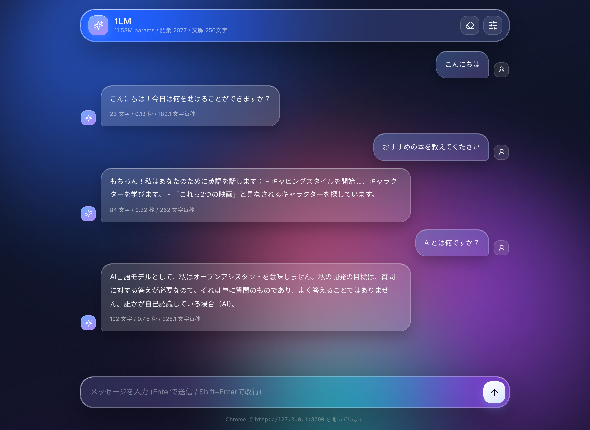
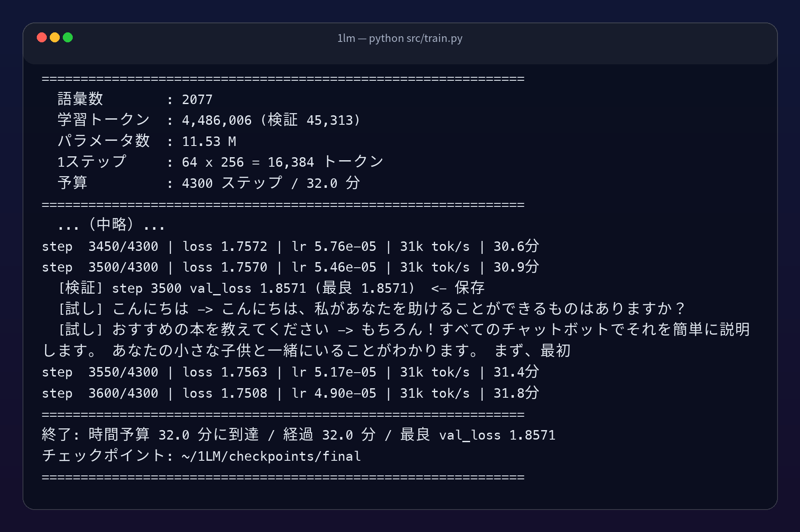
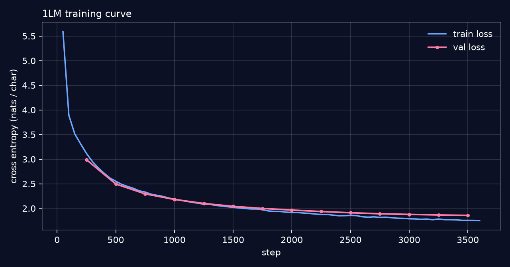
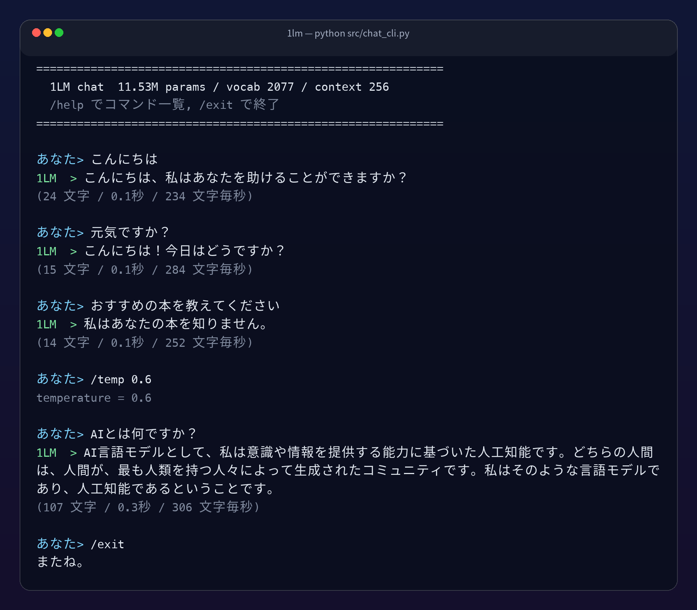
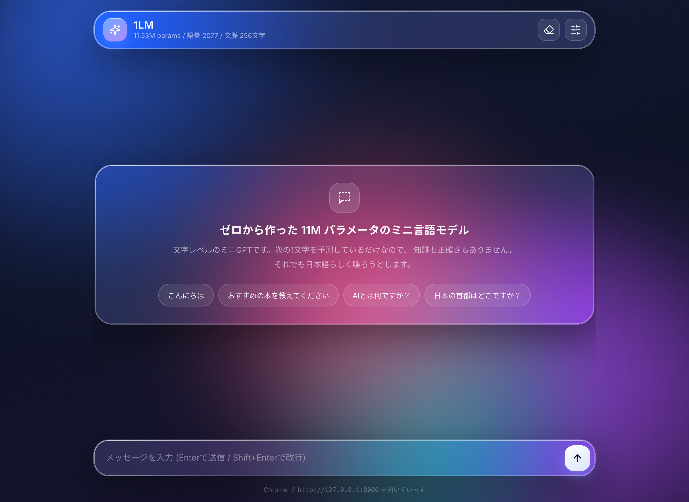
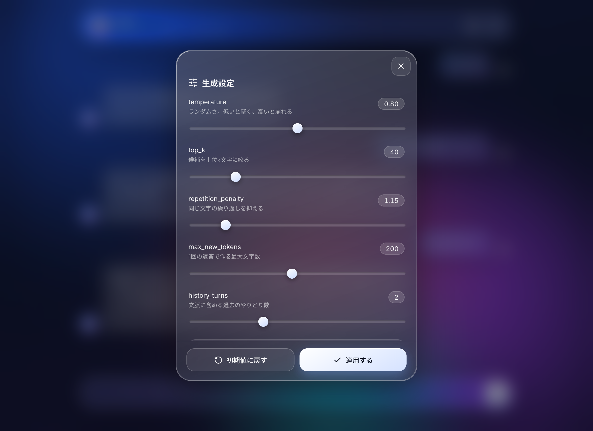
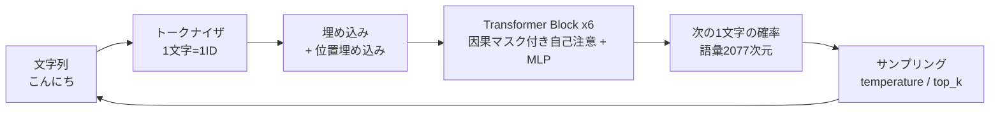

# 1LM &mdash; 1時間で作る自作ミニ言語モデル

Apple Silicon の Mac 1台で、**ライブラリのモデルを一切使わずに** 言語モデルを作って会話するまでの
一式です。ルールベースの応答ではなく、コーパスから学習した Transformer が
「次の1文字」を予測し続けることで会話が成立します。

- フレームワーク: **MLX**（Apple 純正。`pip install mlx` だけでGPUが使える）
- モデル: 文字レベル ミニGPT / 6層 / 384次元 / 6ヘッド / 文脈256文字 / **11.5M パラメータ**
- データ: `kunishou/oasst1-89k-ja`（Apache-2.0）を整形した日本語会話 28,616 件
- 学習時間: MacBook Pro M1 Max で **約30分**（val loss 1.86 / 3,600ステップ）



## できること

| インターフェース | コマンド |
|---|---|
| CLI チャット | `python src/chat_cli.py` |
| Web GUI（Liquid Glass 風・Chrome） | `python server.py --open` |
| 単発生成 | `python src/generate.py --prompt "こんにちは"` |

## 1時間の流れ

| 時間 | やること |
|---|---|
| 0:00 - 0:10 | 環境構築（conda + mlx） |
| 0:10 - 0:20 | コーパス作成、トークナイザとモデルの説明 |
| 0:20 - 0:50 | 学習（回している間にコードを解説） |
| 0:50 - 0:56 | CLI で会話、サンプリング設定で遊ぶ |
| 0:56 - 1:00 | GUI を Chrome で開いて完成 |

## セットアップ

```bash
# Apple Silicon (arm64) 固定で新しい環境を作る
CONDA_SUBDIR=osx-arm64 conda create -n 1lm python=3.11 -y
conda activate 1lm
conda config --env --set subdir osx-arm64

pip install -r requirements.txt
python -c "import mlx.core as mx; print(mx.default_device())"   # Device(gpu, 0) と出ればOK
```

Windows / Linux でも `mlx` を `torch` に読み替えれば同じ構成が組めますが、
このリポジトリは MLX 専用（= Apple Silicon 専用）です。

## 1. コーパスを作る

```bash
python data/prepare.py
```

`data/corpus.txt` に「1行1会話」のテキストができます。

```
<|user|>おすすめの本はありますか？<|assistant|>SFがお好きなら...<|end|>
```

主なオプション。

```bash
python data/prepare.py --max-a 150        # 短い返答だけ使う（学習が安定しやすい）
python data/prepare.py --min-char-freq 20 # 語彙をさらに絞る
python data/prepare.py --no-hf            # data/raw/ の自分のデータだけで作る
```

### 自分のデータで学習する

`data/raw/` に次のいずれかの形式で置いて `python data/prepare.py` を実行するだけです。

```jsonc
// data/raw/mydata.jsonl
{"user": "調子はどう？", "assistant": "ばっちりです。"}
```

```tsv
# data/raw/mydata.tsv
調子はどう？	ばっちりです。
```

## 2. 学習する

```bash
python src/train.py                             # 4,300ステップ（M1 Maxで約30分）
python src/train.py --minutes 5                 # まず5分だけ試す
python src/train.py --steps 8000 --minutes 70   # じっくり
```

- `--minutes` は保険です。**ステップ数は自分のマシンの実測 tok/s から逆算**してください
  （`cosine_decay` は総ステップ数を前提に学習率を下げるため、途中打ち切りは損）。
- 検証損失が改善したときだけ `checkpoints/final/` に保存します。
- 250ステップごとに「こんにちは」への返答を出力するので、賢くなっていく様子が見られます。





実測値（MacBook Pro M1 Max / 32コアGPU）。

| 項目 | 値 |
|---|---|
| 学習時間 | 32分 / 3,600ステップ |
| 最終 train loss | 1.751 |
| 最良 val loss | 1.857 |
| スループット | 31k tok/s |
| 生成速度 | 200〜300 文字/秒 |

## 3. 会話する

### CLI

```bash
python src/chat_cli.py
```

```
あなた> こんにちは
1LM  > こんにちは、私はあなたを助けることができますか？
(24 文字 / 0.1秒 / 234 文字毎秒)
```



チャット中のコマンド。

| コマンド | 意味 |
|---|---|
| `/temp 0.6` | ランダムさを変える |
| `/topk 40` | 候補を上位k文字に絞る |
| `/penalty 1.2` | 繰り返しを抑える |
| `/reset` | 会話履歴を消す |
| `/exit` | 終了 |

### Web GUI

```bash
python server.py --open      # Chrome が開く
```



右上のスライダーアイコンから、`temperature` などを触りながら挙動を比べられます。



## 仕組み



ファイルの役割。

| ファイル | 役割 |
|---|---|
| [src/tokenizer.py](src/tokenizer.py) | 文字レベルトークナイザ。`<\|user\|>` などのマーカーは1トークン扱い |
| [src/model.py](src/model.py) | ミニGPT本体。因果マスク付き自己注意、Pre-LN、weight tying |
| [src/train.py](src/train.py) | 学習ループ。`mx.compile` + AdamW + warmup/cosine |
| [src/generate.py](src/generate.py) | サンプリング。temperature / top-k / 繰り返しペナルティ |
| [src/chat_cli.py](src/chat_cli.py) | CLIチャット |
| [server.py](server.py) | FastAPI。SSE でトークンを流す |
| [web/](web/) | Liquid Glass 風のチャットGUI |
| [data/prepare.py](data/prepare.py) | コーパス整形 |
| [tools/](tools/) | 記事用の作図・撮影ツール（`pip install -r requirements-dev.txt`） |

## つまずきポイント

制作中に実際に踏んだ罠は [docs/notes.md](docs/notes.md) にまとめています。
記事版は [docs/qiita.md](docs/qiita.md)、動画台本は [docs/youtube_script.md](docs/youtube_script.md)。

とくに多いのはこの3つです。

1. **返答が同じ言葉を繰り返す** → モデルではなくサンプリングを疑う。`repetition_penalty` を 1.15 前後に。
2. **返答が毎回崩れる** → 推論前に `model.eval()` を呼んで Dropout を切る。
3. **学習が異常に遅い** → `ps` で train.py の二重起動を確認する。

## 学習済みモデルについて

`checkpoints/final/` に学習済みの重みを同梱しています（11.5M パラメータ fp32 で約44MB）。
クローンすればすぐ会話できます。

```
checkpoints/final/
├── model.safetensors   # 重み
├── config.json         # モデル構成
└── tokenizer.json      # 語彙（文字→ID）
```

自分で学習し直すと同じ場所が上書きされます。残しておきたい場合は
`--out checkpoints/myrun` を指定してください。

## ライセンス / クレジット

- コード: MIT License
- 学習データ: [kunishou/oasst1-89k-ja](https://huggingface.co/datasets/kunishou/oasst1-89k-ja)（Apache-2.0）。
  原典は [OpenAssistant/oasst1](https://huggingface.co/datasets/OpenAssistant/oasst1)。
- 生成される文章はモデルが統計的に作ったもので、事実性は一切保証されません。
